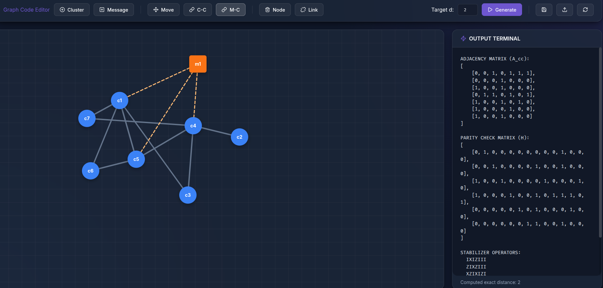

# Quantum Cluster Parity Check Builder

A professional, high-fidelity standalone application for building and analyzing quantum cluster graphs, computing parity check matrices, and extracting logical operators and code distances.

 *(Optional: Add a screenshot here later)*

## Features
- **Interactive Canvas**: Draw cluster and message nodes with an intuitive, modern interface.
- **Glassmorphic Design**: A premium dark-mode UI with smooth transitions and animations.
- **Real-time Logic**: Extracted from state-of-the-art quantum code research.
- **Exact Distance Calculation**: Rigorous stabilizer analysis for code verification.
- **Portable**: Run locally with a simple Python command.

## Quick Start

### 1. Prerequisites
Ensure you have Python 3.8+ installed.

### 2. Install Dependencies
```bash
pip install -r requirements.txt
```

### 3. Run the Application
```bash
python app.py
```
The application will automatically start a local server and open your default web browser to `http://127.0.0.1:5000`.

## Directory Structure
- `app.py`: Main entry point (Flask server + browser automation).
- `core/`: Python mathematical logic and utilities.
- `static/`: Compiled premium web UI (React/Vite build).
- `requirements.txt`: Python package dependencies.

## Academic Context
This tool is designed for research in Quantum Error Correction (QEC), specifically focusing on Cluster-State based codes and parity check matrix construction from graphical representations.
